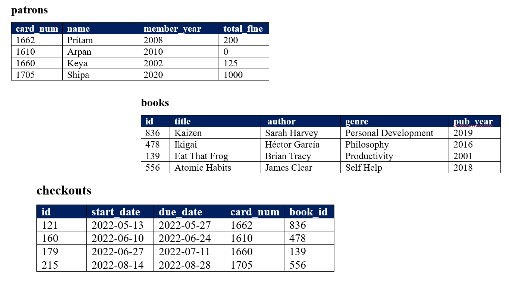
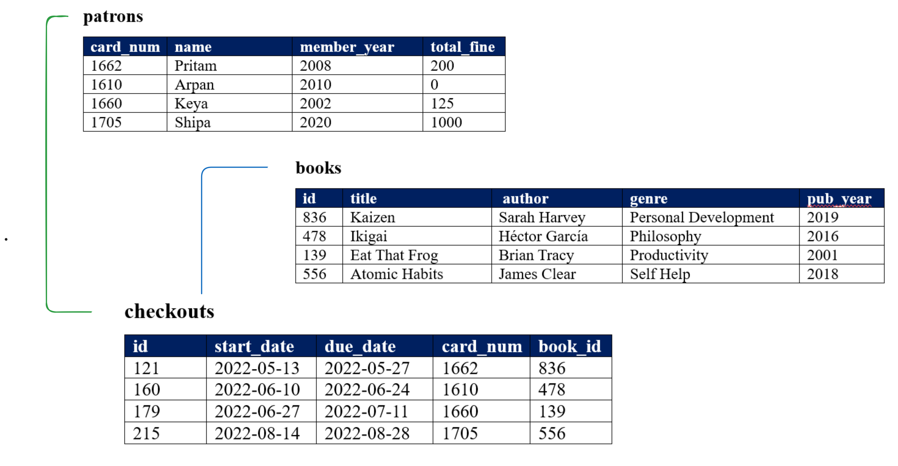

# Introduction to Database
A **database** is an **organized collection of data stored** & **managed** so that it can be easily **accessed**, **modified** & **retrieved** when needed. Databases store various types of data—from customer details in a business to product inventories in a store. We can add new data, update existing information, delete unwanted records & search for specific details using queries. 

    

They come in **Two** main types:
1. **SQL Databases :** These use structured tables to organize data, like a spreadsheet with rows and columns (e.g., MySQL, PostgreSQL).
2. **NoSQL Databases :** These use flexible data models, like documents or graphs, which can be more adaptable for unstructured data (e.g., MongoDB, Cassandra).
## Relational Database 
A **Relational Database is a type of database**. While a **database is a general term for any organized collection of data**, a relational database specifically uses a **structured format**, **organizing data into tables with rows and columns**. This **structure is based on the relational model**, which allows data in different tables to be linked by relationships, making it ideal for managing data with well-defined connections. 

    

In short:
- **Database :** A **general data storage system**.
- **Relational Database :** A **type of database** that uses **tables and relationships** to structure and **link data**.
## Database Advantages
- **Efficient Data Management :** Organizes data for **easy access**, **retrieval** & **updates**.
- **Data Integrity :** Ensures data **accuracy** and **consistency**.
- **Scalability :** Expands to handle **large data volumes** more than a **spreadsheet** can.
- **Security :** **Protects data** with **access controls** & **encryption**.
- **Backup and Recovery :** **Enables data restoration** after failures.
- **Concurrent Access :** **Allows multiple users** to access data simultaneously.
- **Reduced Redundancy :** **Minimizes data duplication** with **relational links**.
- **High Storage Capacity :** Can store **significantly larger datasets than spreadsheets**.