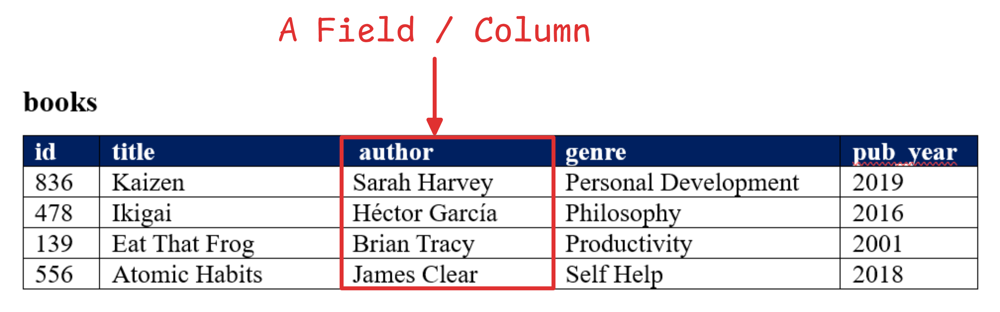
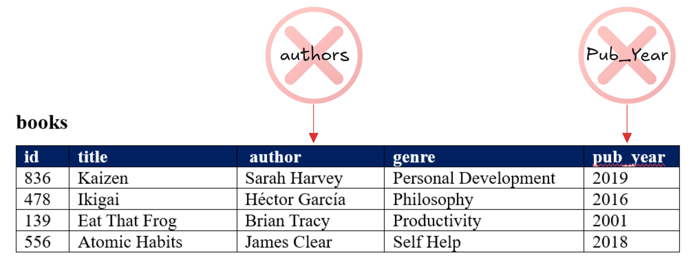

# SQL (Structured Query Language)
**SQL** is a **standard programming language** used to **manage** and **manipulate relational databases**. It allows us to **create**, **read**, **update** & **delete** data in a database.

With **SQL**, we can :
- **Query Data :** **Retrieve specific information** from the database.
- **Insert Data :** **Add new records** to tables.
- **Update Data :** **Modify** existing records.
- **Delete Data :** **Remove** records.
- **Define Structure :** **Create** & **modify tables** and **database schema**.

**SQL** is **widely used in relational database systems** like **MySQL**, **PostgreSQL**, **Oracle** & **SQL Server**. Making it essential for working with structured data in relational databases.
## Tables in SQL
In SQL, **a table is where data is stored** in a **structured format**. It's made up of **rows** and **columns** and **forms the fundamental unit** of **storage in a relational database**.
## Key Components of a Table
Table names should 
- Be **Lowercase**.
- Have **No Spaces**. Use **Underscores (`_`)** instead.
- Refer to a **Collective Group** or be **Plural**.

    

### Columns
A **Field** is a **Column** that holds **one piece** of **information** about **all records**.

    

- **Tables columns** are refered as **Fields**.
- Each column holds a specific type of data (e.g., integers, strings, dates).
- Each column has a **name** & a **data type** (e.g., INT, VARCHAR, DATE).
- Columns are set at database creation.
- Field names should :
    - Be **Lowercase**.
    - Have **No Spaces**.
    - **Be Singular**.
    - Be **Different** from **Other Field Names**.
    - Be **Different** from the **Table Name**.

    

    
### Rows
A **Record** is a **row** that **holds data** on an **individual observation**.
- **Table rows** are referred as **records**.
- Each row represents a **single record** in the table.
- There is **no limit** to the number of records.
### Primary Key
**Unique identifiers** are used to **identify records** in a table. They are **unique** and often **numbers**.
- A **unique identifier** for each **row** ensuring that **no two rows have the same value** for this column.
- **Example :** An "id" column with unique values for each row.
### Foreign Key
- A **column in one table** that refers to the **primary key of another table** establishing a relationship between the two.
- **Example :** A "department_id" in the "employees" table might be a foreign key referring to the "id" in the "departments" table.
### Constraints
**Constraints** are **rules applied** to **table columns** to enforce data integrity. 
- **Example :** NOT NULL, UNIQUE, CHECK, etc.
## SQL Data Types
In SQL, data types **define the type of data that can be stored in a column of a table**. Each **column must be assigned a data type** when the table is **created** & it determines the **kind of values the column can store**.
## Common SQL Data Types
### Numeric Types
- **INT :** Used to **store integers** (whole numbers).
    - **Example :** **`age INT`**
- **DECIMAL** or **NUMERIC :** Used to **store exact numeric values** with a **specified precision** and **scale**.
    - **Example :** **`price DECIMAL(10, 2)`** (10 total digits, 2 digits after the decimal point).
- **FLOAT / REAL :** Used for **approximate numeric values** typically with **floating-point precision**.
    - **Example :** **`height FLOAT`**

    

### Character/String Types
- **CHAR(n) :** Fixed-length character string. If the data is shorter than n, it will be padded with spaces.
    - **Example :** **`gender CHAR(1)`**
- **VARCHAR(n) :** Variable-length character string. Can store strings up to **`n`** characters.
    - **Example :** **`name VARCHAR(100)`**
- **TEXT :** Used for storing large text values.
    **Example :** **`description TEXT`**

    

### Date and Time Types
- **DATE :** Stores date values (year, month, day).
    - **Example :** **`birth_date DATE`**
- **TIME :** Stores time values (hour, minute, second).
    - **Example :** **`start_time TIME`**
- **DATETIME :** Stores both date and time values.
    - **Example :** **`created_at DATETIME`**
- **TIMESTAMP :** Similar to DATETIME but typically used for tracking changes and storing the time of an event in a database.
    - **Example :** **`last_updated TIMESTAMP`**

    

### Boolean Type
- **BOOLEAN :** Stores TRUE or FALSE values.
    - **Example :** is_active BOOLEAN
### Binary Types
- **BLOB (Binary Large Object) :** Used to store binary data such as images, audio or other files.
    - **Example :** **`profile_picture BLOB`**
### Other Data Types
- **ENUM :** A string object with a predefined list of values (useful for columns that have a fixed set of options).
    - **Example :** **`status ENUM('active', 'inactive', 'suspended')`**
- **JSON :** Stores JSON formatted data for structured but flexible storage.
    - **Example :** **`preferences JSON`**
## Scema
A schema is a logical container or blueprint that defines the structure of a database. It organizes database objects like tables, views, indexes & relationships in a way that makes it easier to manage and understand the data.

    

## Storage
**Database Storage** refers to **how data is physically stored** and **managed** in a database. It involves **organizing data in structures** like **tables**, **data files** & **pages**, **stored on physical devices** such as **hard drives** or **SSDs**. Key elements include tablespaces for **grouping data**, **indexes for fast retrieval** & **data compression** or **encryption** for **optimization** and **security**. Databases also use **replication for high availability** and **backups** for **data protection**. **Efficient storage management** ensures **data integrity**, **performance** & **scalability**.
## SQL Queries
**SQL Queries** are **commands** used to **interact with a database**. They allow us to **retrieve, insert, update** or **delete data** from a **database**. 
### SELECT 
The **`SELECT`** **statement** is used to **retrieve data from a database**. It's one of the most commonly used SQL commands.
### Aliasing in SQL
**Aliasing in SQL** is used to give a **table or column a temporary name** (alias) **to make queries easier to read** or **to simplify complex queries**. Aliases are especially useful when working with long or complex table and column names. There are **two types** of **aliasing** in SQL:
1. **Column Alias :** **Assigns a temporary name to a column** in the **result set**. A column alias **gives a column a temporary name**. It’s useful when you want the result of a column expression (like calculations) to be more readable.
2. **Table Alias :** **Assigns a temporary name to a table**, often used to make **joins** and **queries** more concise. A table **alias assigns a temporary name** to a table. This is particularly helpful when joining multiple tables, as it makes the query easier to read and write.
### View in SQL
A **view is a virtual table** in a **database that is based on the result of a SQL query**. It doesn't **store data itself but rather stores the SQL query** used to **retrieve data from one or more tables**. Views are often used to **simplify complex queries or to provide an abstraction layer for security purposes**.
For More visir [**SQL Queries**](https://github.com/PritamChakrabortyShuvo/SQL/blob/main/00_SQL-Queries.md)

